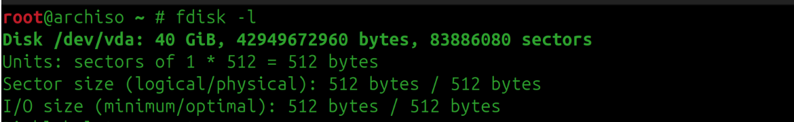
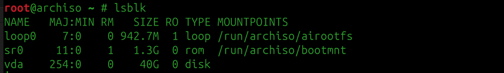
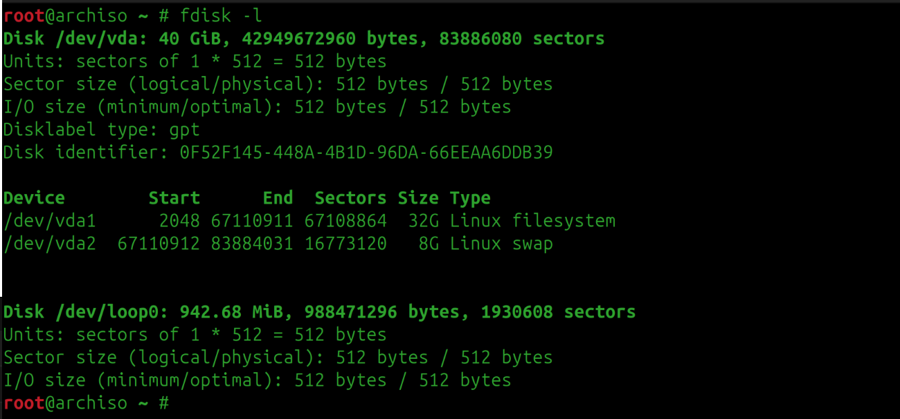

First we will choose a host OS which will give us a base to compile all the neccessary packages and kernel.

In my case i have use Archlinux live cd for neccessary builds (you can with Gentoo or any arch based linux as host).

Gentoo is good as community says (It has network enabled and required packages for LFS).

I have used KVM virtualization using Qemu (You are free to use any virtualization software).

This is going to  be strictly based on arch and arch based systems.

1. First Load the host ISO in live mode(If you have a GUI then immediately go to tty screen)
2. Check Network adapter is up or not
    ip link
    

3. Check IP addr 
    ip addr
    

4. Check SSHD Service is runnning or not
    systemctl status sshd
    

5. Set the password for the root user
    passwd

6. After setting the password ssh to the arch live os from any system (As it gives us power to copy paste any command directly)

7. Create a file then copy paste the code from system_check.sh from scripts folder
    1. give the file executable permission
        chmod +x file_name
    2. Run the file 
        ./file_name

    

8. Before moving to installing our missing packages we need to setup our disk partitions where we can install and compile our packages 
    1. For this we will create two partitions on the disk 
        We will create two partitions on the disk:
        1. Root partition: This will be the main workspace where the system is installed and all packages are compiled.
        2. Swap partition: This will act as additional memory, helping the system when physical RAM is not sufficient during heavy compilation tasks.

    2. To create partition in a drive follow the below commands 
        We will use fdisk utility for partitioning the table
            1. fdisk -l (It will show all the drives)
            
            2. lsblk (It will show all the partitions in the drive)
            
            3. fdisk /dev/vda (replace /dev/vda with the correct disk on your system, such as /dev/sda). Take a moment to double-check the device name before pressing Enter—if you have more than one OS or disk, choosing the wrong one can wipe out the wrong system.
            After entering the fdisk utility type:
            1. g (To create a GPT partition table)
            2. n (To create a new partition)
                1. Select the partition number (Choose it as default or press enter)
                2. Add the sector size (In my case i have given root partition as 38gb) so type +32G
            3. t (To provide the partition type)
                1. enter or 1 (Select the partiton number choose default)
                2. L (To list all the available partition type for root select Linux File System: 20)
                3. 20  (This will set the partiton type as Linux File System)
            (Do this again to create a swap partition: Linux swap partition number is 19)

    3. After creation of partition we will create the file system on the partition 
        There are many types of file systems available in linux like ext4, ext3, ext2
        For our root partition we will create a ext4 file system 
        Now in terminal type the following command to create a ext4 file system
            1. mkfs -v -t ext4 /dev/dva1 (Here we need to select the partition name not the disk name) (You can always type "lsblk" to see all the disk and partitions inside it)
            2. mkswap /dev/vda2

    4. After creating the file system check if everything is correct or not then proceed
        After creation of file system if we do fdisk -l we will get the following
        

9. There are some neccessary packages are missing so we have to install them manually 
    1. We will start with bison
        N.B. When we run pacman -Sy bison it won't run (As we have not setup the pgp keyring we need to set that up first)
            1. First we will initialize the keyring
                pacman-key --init
            2. Next we will import all the trusted arch maintainers keys
                pacman-key --populate archlinux
            3. Next we will refresh the  keys
                pacman-key --refresh-keys (It may take upto 20 to 30 minutes for me it took aroung 20 minutes)
            
        Install Bison
            pacman -Sy bison
    2. Next GCC
        pacman -Sy gcc

