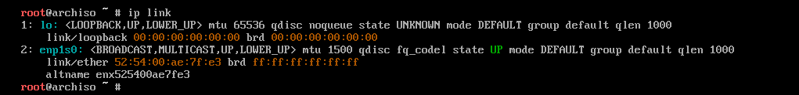
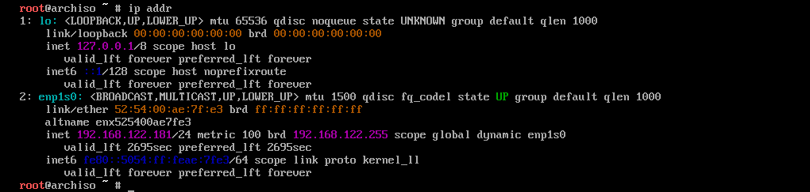
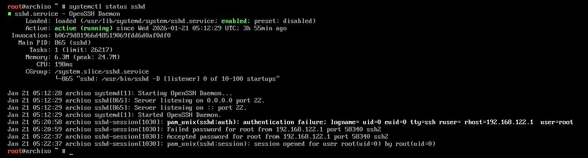
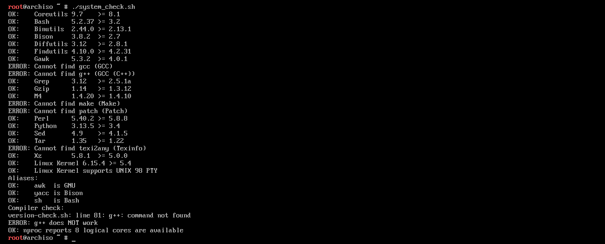

First we will choose a host OS which will give us a base to compile all the neccessary packages and kernel
In my case i have use Archlinux live cd for neccessary builds (you can with Gentoo or any arch based linux as host)
Gentoo is good as community says (It has network enabled and required packages for LFS)
I have used KVM virtualization using Qemu (You are free to use any virtualization software)
This is going to  be strictly based on arch and arch based systems

1. First Load the host ISO in live mode(If you have a GUI then immediately go to tty screen)
2. Check Network adapter is up or not
    ip link
    

3. Check IP addr 
    ip addr
    

4. Check SSHD Service is runnning or not
    systemctl status sshd
    

5. Set the password for the root user
    passwd

6. After setting the password ssh to the arch live os from any system (As it gives us power to copy paste any command directly)

7. Create a file then copy paste the code from system_check.sh from scripts folder
    1. give the file executable permission
        chmod +x file_name
    2. Run the file 
        ./file_name

    

8. There as=re some neccessary packages are missing so we have install them manually 
    1. We will start with bison
        # When we run pacman -Sy bison it won't run (As we have not setup the pgp keys we need to set that up first)
            1. First we will initialize the keyring
                pacman-key --init
            2. Next we will import all the trusted arch maintainers keys
                pacman-key --populate archlinux
            3. Next we will refresh the  keys
                pasman-key --refresh-keys
            
        Install Bison
            pacman -Sy bison
    2. 

