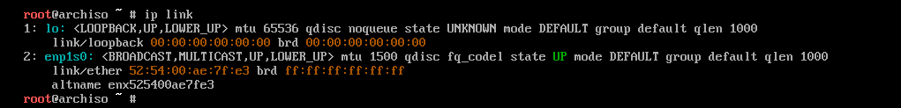
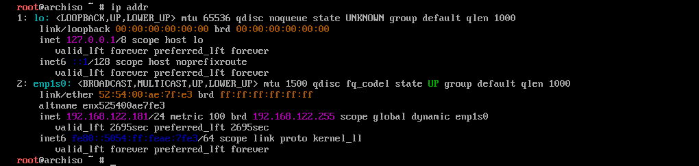
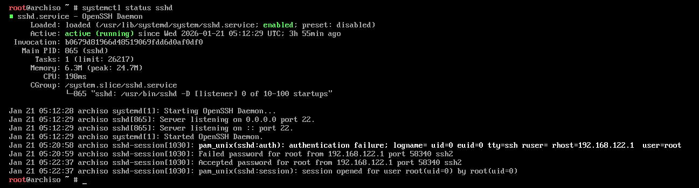
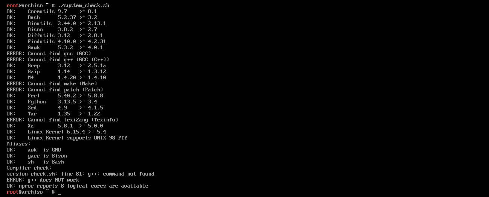

First we will choose a host OS which will give us a base to compile all the neccessary packages and kernel.

In my case i have use Archlinux live cd for neccessary builds (you can with Gentoo or any arch based linux as host).

Gentoo is good as community says (It has network enabled and required packages for LFS).

I have used KVM virtualization using Qemu (You are free to use any virtualization software).

This is going to be strictly based on arch and arch based systems.

1. First install the OS and go to tty screen. (I will prefer cli over GUI as mostly we will need a terminal for compiling the linux kernel and other modules, so don't bother to add a desktop environment)
2. Check Network adapter is up or not
    ip link
    

3. Check IP addr 
    ip addr
    

4. Check SSHD Service is runnning or not
    systemctl status sshd
    

5. Set the password for the root user
    passwd

6. After setting the password ssh to the arch live os from any system (As it gives us power to copy paste any command directly)

7. Create a file then copy paste the code from system_check.sh from scripts folder
    1. give the file executable permission
        chmod +x file_name
    2. Run the file 
        ./file_name

    

8. Here I have already created a blank partition for LFS installation (This partition is required to build the LFS system)
    1. If you have not follow the below instructions
        1. First we will create a blank partition for LFS
            mkfs -v -t ext4 /dev/<xxx> (Run this o create a blank partition)(Replace the <xxx> with your name of the LFS partition)

            If you don't have a swap create it using the below commands
                mkswap /dev/<yyy>

9. Now we will set the $LFS variable and Umask
    1. export LFS=/mnt/lfs
        Having this variable set is beneficial for the future builds as it gives us the path of the filesystem we are about to create.
    2. umask 022
        having umask set to 022  ensures that newly created files and directories are only writable by their owner, but are readable and searchable (only for directories) by anyone.
    N.B. Add these commands to .bashrc_profile of both the root and the user of your host system you don't have to do these manually everytime you reboot the system.

10. Mount the newly created partition on $LFS (/mnt/LFS)
        1. mkdir -pv $LFS
        2. mount -v -t ext4 /dev/<xxx> $LFS (<xxx> willl be your LFS partition)
        3. For swal use this 
            /sbin/swapon -v /dev/<zzz>
        N.B. Complete the whole LFS in one go or else you need to mount the LFS filesystem everytime you reboot

11. Now we are going to download and install some neccessary packages in order to build a basic linux system.
    1. First we will create a folder where we will store our all pacgages tar balls.
        mkdir -v $LFS/sources (This will create the folder)
        chmod -v a+wt $LFS/sources (This will create a Sticky directory) (Means only owner can delete the files inside it)

    We can download packages manually one by one or we can do it with one go using wget-list 
    For the wget list we need to create a file of all the packages list
        wget --input-file=wget-list-sysv --continue --directory-prefix=$LFS/sources

